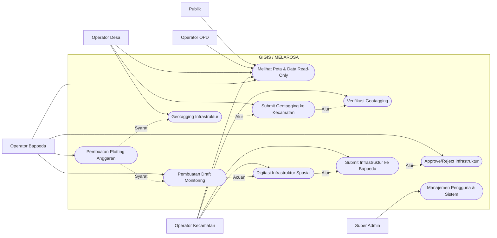

# Use Cases

Bagian ini mendefinisikan kasus penggunaan (_Use Cases_) utama di dalam sistem GIGIS / MELAROSA, yang mencakup interaksi antara berbagai aktor (Publik, Desa, Kecamatan, Bappeda, OPD, Super Admin) dengan sistem sesuai dengan aturan bisnis yang telah ditetapkan.

## Diagram Use Case

## Deskripsi Use Case

1. **UC0: Melihat Peta & Data Read-Only**: Aktor Publik, Operator OPD, Desa, Kecamatan, dan Bappeda dapat melihat peta interaktif, batas wilayah, serta laporan/rekapitulasi sesuai batasan aksesnya masing-masing. Publik hanya dapat melihat data yang sudah disetujui.
2. **UC1: Pembuatan Plotting Anggaran**: Operator Bappeda membuat data plotting anggaran yang akan menjadi dasar (syarat) pelaksanaan pendataan infrastruktur di tahun berjalan.
3. **UC2: Geotagging Infrastruktur**: Operator Desa melakukan input form geotagging beserta titik lokasi awal. Proses ini **hanya bisa dilakukan jika Plotting Anggaran (UC1) sudah dibuat** oleh Bappeda untuk desa tersebut.
4. **UC3 & UC4: Submit & Verifikasi Geotagging**: Operator Desa mengajukan (submit) form geotagging ke tingkat Kecamatan. Operator Kecamatan bertugas memverifikasinya.
5. **UC5: Pembuatan Draft Monitoring**: Operator Bappeda membuat Draft Monitoring berdasarkan Plotting Anggaran (UC1) sebagai inisiasi proses pemantauan riwayat kondisi fisik infrastruktur.
6. **UC6: Digitasi Infrastruktur Spasial**: Operator Kecamatan melakukan penggambaran geometri (garis/poligon) dan pengisian atribut dinamis secara interaktif melalui WebGIS. **Proses ini wajib mengacu pada Draft Monitoring (UC5)** dari Bappeda.
7. **UC7 & UC8: Submit Infrastruktur & Approval Bappeda**: Operator Kecamatan mengajukan hasil digitasi spasial ke tingkat Bappeda. Bappeda melakukan persetujuan (_approve_) atau penolakan (_reject_ dengan catatan). Data yang disetujui menjadi data final yang terpublikasi.
8. **UC9: Manajemen Pengguna & Sistem**: Super Admin mengelola otorisasi, menambah akun, mengatur _role_, dan memetakan hak akses wilayah (_id_desa_, _id_kecamatan_).
