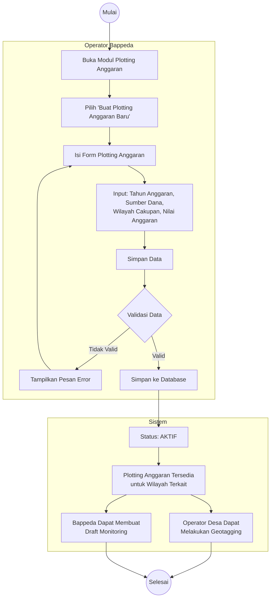

# Activity Diagram: Pembuatan Plotting Anggaran

Diagram aktivitas ini menggambarkan alur kerja pembuatan Plotting Anggaran oleh Operator Bappeda. Plotting Anggaran menjadi **prasyarat** bagi Operator Desa untuk melakukan geotagging (AD-2) dan bagi Bappeda untuk membuat Draft Monitoring (AD-4).

**Use Case Terkait**: [UC-1 Pembuatan Plotting Anggaran](../03-use-cases/UC-1-pembuatan-plotting-anggaran.md)

## Penjelasan Alur

1. **Inisiasi**: Operator Bappeda membuka modul Plotting Anggaran dan memilih buat baru.
2. **Pengisian Form**: Operator mengisi tahun anggaran, sumber dana, wilayah cakupan (kecamatan/desa target), dan nilai anggaran.
3. **Validasi**: Sistem memvalidasi kelengkapan data. Jika tidak valid, dikembalikan ke form.
4. **Penyimpanan**: Data tersimpan dengan status **aktif**.
5. **Dampak**: Plotting Anggaran aktif membuka akses bagi Operator Desa untuk geotagging dan bagi Bappeda untuk membuat Draft Monitoring.
