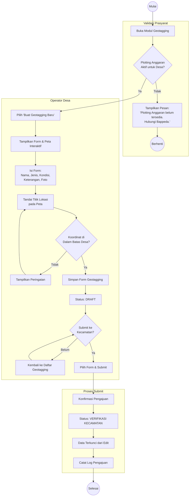

# Activity Diagram: Geotagging & Submit ke Kecamatan

Diagram aktivitas ini menggambarkan alur kerja Operator Desa dalam melakukan geotagging infrastruktur dan mengajukan form ke tingkat Kecamatan untuk diverifikasi.

**Use Case Terkait**: [UC-2 Geotagging Infrastruktur](../03-use-cases/UC-2-geotagging-infrastruktur.md), [UC-3 Submit Geotagging ke Kecamatan](../03-use-cases/UC-3-submit-geotagging-ke-kecamatan.md)

## Penjelasan Alur

1. **Validasi Prasyarat**: Sistem memeriksa apakah Plotting Anggaran sudah aktif untuk desa. Jika belum, proses dihentikan.
2. **Pengisian Form**: Operator Desa mengisi informasi infrastruktur dan menandai titik lokasi pada peta.
3. **Validasi Koordinat**: Sistem memastikan titik geotagging berada di dalam batas poligon administrasi desa.
4. **Simpan Draft**: Data tersimpan dengan status `draft`. Operator dapat mengedit sebelum di-submit.
5. **Submit**: Operator mengajukan form ke Kecamatan. Status berubah menjadi `verifikasi_kecamatan` dan data terkunci.
