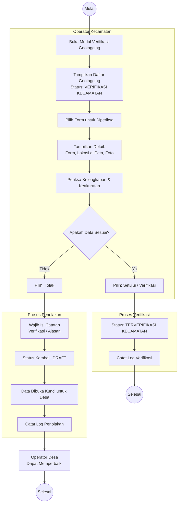

# Activity Diagram: Verifikasi Geotagging oleh Kecamatan

Diagram aktivitas ini menggambarkan alur kerja Operator Kecamatan dalam memverifikasi form geotagging yang diajukan oleh Operator Desa.

**Use Case Terkait**: [UC-4 Verifikasi Geotagging](../03-use-cases/UC-4-verifikasi-geotagging.md)

## Penjelasan Alur

1. **Daftar Verifikasi**: Operator Kecamatan melihat daftar form geotagging berstatus `verifikasi_kecamatan` di wilayah kecamatannya.
2. **Pemeriksaan**: Operator memeriksa detail form, lokasi di peta, dan kelengkapan data.
3. **Keputusan**:
   - **Setujui**: Status berubah menjadi `terverifikasi_kecamatan`. Data menjadi referensi valid.
   - **Tolak**: Wajib mengisi catatan alasan. Status kembali ke `draft` dan data dibuka kunci agar Operator Desa dapat memperbaiki.
4. **Log**: Setiap keputusan tercatat di log verifikasi beserta nama verifikator dan waktu.
