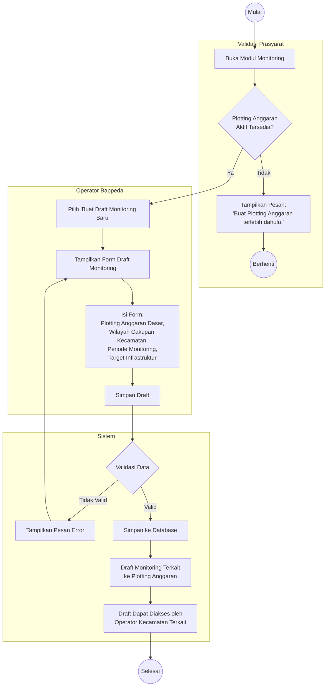

# Activity Diagram: Pembuatan Draft Monitoring

Diagram aktivitas ini menggambarkan alur kerja Operator Bappeda dalam membuat Draft Monitoring berdasarkan Plotting Anggaran. Draft monitoring menjadi **acuan resmi** bagi Operator Kecamatan untuk melakukan digitasi infrastruktur spasial.

**Use Case Terkait**: [UC-5 Pembuatan Draft Monitoring](../03-use-cases/UC-5-pembuatan-draft-monitoring.md)

## Penjelasan Alur

1. **Validasi Prasyarat**: Sistem memeriksa keberadaan Plotting Anggaran aktif. Tanpa plotting, draft tidak dapat dibuat.
2. **Pengisian Form**: Bappeda memilih Plotting Anggaran sebagai dasar, menentukan wilayah kecamatan target, periode monitoring, dan target infrastruktur yang harus didigitasi.
3. **Penyimpanan**: Draft tersimpan dan dikaitkan ke `plotting_id`.
4. **Dampak**: Operator Kecamatan di wilayah target kini dapat melihat draft dan melakukan digitasi infrastruktur spasial (AD-5).
