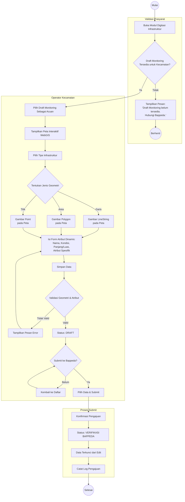

# Activity Diagram: Digitasi Infrastruktur & Submit ke Bappeda

Diagram aktivitas ini menggambarkan alur kerja Operator Kecamatan dalam melakukan digitasi data infrastruktur spasial berdasarkan Draft Monitoring dari Bappeda, lalu mengajukannya ke Bappeda untuk diverifikasi.

**Use Case Terkait**: [UC-6 Digitasi Infrastruktur Spasial](../03-use-cases/UC-6-digitasi-infrastruktur-spasial.md), [UC-7 Submit Infrastruktur ke Bappeda](../03-use-cases/UC-7-submit-infrastruktur-ke-bappeda.md)

## Penjelasan Alur

1. **Validasi Prasyarat**: Sistem memeriksa keberadaan Draft Monitoring untuk kecamatan. Tanpa draft, digitasi tidak dapat dilakukan.
2. **Pemilihan Acuan**: Kecamatan memilih Draft Monitoring sebagai acuan digitasi.
3. **Digitasi Geometri**: Operator menggambar geometri sesuai tipe infrastruktur (LineString, Polygon, atau Point) pada peta interaktif.
4. **Atribut Dinamis**: Operator mengisi form atribut yang tampil secara dinamis berdasarkan tipe infrastruktur (disimpan sebagai JSONB).
5. **Validasi**: Sistem memvalidasi kesesuaian tipe geometri dan kelengkapan atribut.
6. **Submit**: Data yang sudah didigitasi diajukan ke Bappeda. Status berubah menjadi `verifikasi_bappeda` dan data terkunci.
