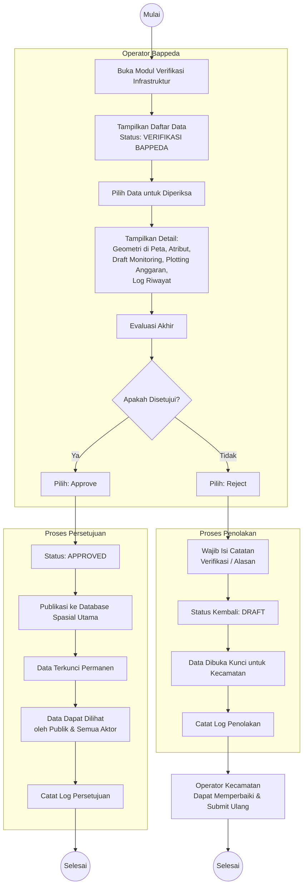

# Activity Diagram: Approve/Reject Infrastruktur oleh Bappeda

Diagram aktivitas ini menggambarkan alur kerja Operator Bappeda dalam melakukan persetujuan atau penolakan data infrastruktur spasial yang diajukan oleh Operator Kecamatan.

**Use Case Terkait**: [UC-8 Approve/Reject Infrastruktur](../03-use-cases/UC-8-approve-reject-infrastruktur.md)

## Penjelasan Alur

1. **Daftar Verifikasi**: Bappeda melihat daftar data infrastruktur berstatus `verifikasi_bappeda`.
2. **Evaluasi**: Bappeda memeriksa geometri pada peta, atribut, keterkaitan dengan Draft Monitoring dan Plotting Anggaran, serta log riwayat.
3. **Keputusan**:
   - **Approve**: Status menjadi `approved`. Data dipublikasikan ke database spasial utama, terkunci permanen, dan dapat dilihat oleh semua aktor termasuk publik.
   - **Reject**: Wajib mengisi catatan alasan. Status kembali ke `draft` dan data dibuka kunci agar Kecamatan dapat memperbaiki.
4. **Pembaruan Kondisi**: Jika data yang di-approve memiliki laporan monitoring terkait, sistem dapat memicu pembaruan atribut "kondisi" pada master infrastruktur.
