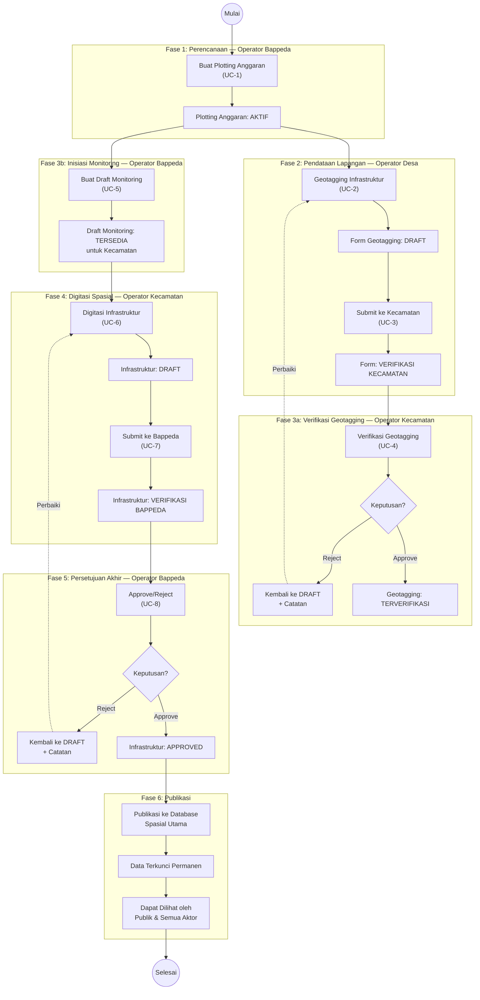

# Activity Diagram: Alur Keseluruhan (End-to-End)

Diagram aktivitas ini menggambarkan alur kerja keseluruhan sistem GIGIS / MELAROSA dari awal (Plotting Anggaran) hingga akhir (Publikasi Data), menunjukkan bagaimana setiap aktor berinteraksi secara berurutan.

**Use Case Terkait**: UC-1 s/d UC-8

## Ringkasan Fase

| Fase | Aktor | Aktivitas | Status Data |
|:---|:---|:---|:---|
| **1. Perencanaan** | Bappeda | Buat Plotting Anggaran | Aktif |
| **2. Pendataan** | Desa | Geotagging + Submit | Draft → Verifikasi Kecamatan |
| **3a. Verifikasi** | Kecamatan | Verifikasi Geotagging | Terverifikasi / Reject |
| **3b. Inisiasi** | Bappeda | Buat Draft Monitoring | Tersedia |
| **4. Digitasi** | Kecamatan | Digitasi Spasial + Submit | Draft → Verifikasi Bappeda |
| **5. Approval** | Bappeda | Approve / Reject | Approved / Reject |
| **6. Publikasi** | Sistem | Publikasi & Kunci Data | Final / Read-Only |

## Alur Penolakan (Reject Path)

- **Reject oleh Kecamatan (Fase 3a)**: Form geotagging dikembalikan ke Operator Desa dengan catatan. Desa memperbaiki dan submit ulang.
- **Reject oleh Bappeda (Fase 5)**: Data infrastruktur dikembalikan ke Operator Kecamatan dengan catatan. Kecamatan memperbaiki dan submit ulang.
