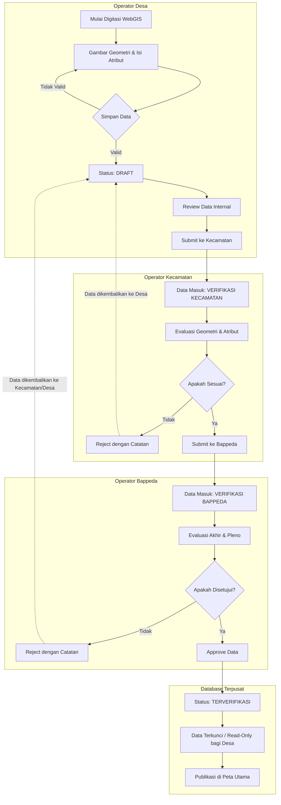

# Activity Diagram: Pengajuan Data Spasial

Diagram aktivitas ini menggambarkan alur kerja pengajuan (submission) data infrastruktur spasial dari tingkat Desa hingga mendapat persetujuan dari Bappeda.

## Penjelasan Alur

1. **Pembuatan Draft**: Operator Desa menggambar segmen jalan/jembatan. Selama statusnya `DRAFT`, operator desa dapat bebas mengubah geometri dan atribut.
2. **Pengajuan Pertama**: Saat data dirasa sudah valid, Operator Desa menekan tombol _Submit_. Status berubah menjadi `verifikasi_kecamatan`. Saat ini, fitur _editing_ untuk akun desa dikunci.
3. **Verifikasi Tingkat 1 (Kecamatan)**: Operator Kecamatan melihat daftar usulan yang masuk. Jika ada kesalahan, data dapat di-_reject_ dan kembali menjadi `DRAFT` (dengan melampirkan catatan revisi). Jika benar, diteruskan menjadi `verifikasi_bappeda`.
4. **Verifikasi Akhir (Bappeda)**: Bappeda memegang otoritas penuh. Setelah di-_approve_, status data berubah menjadi `terverifikasi` dan menjadi bagian dari master data spasial kabupaten.
