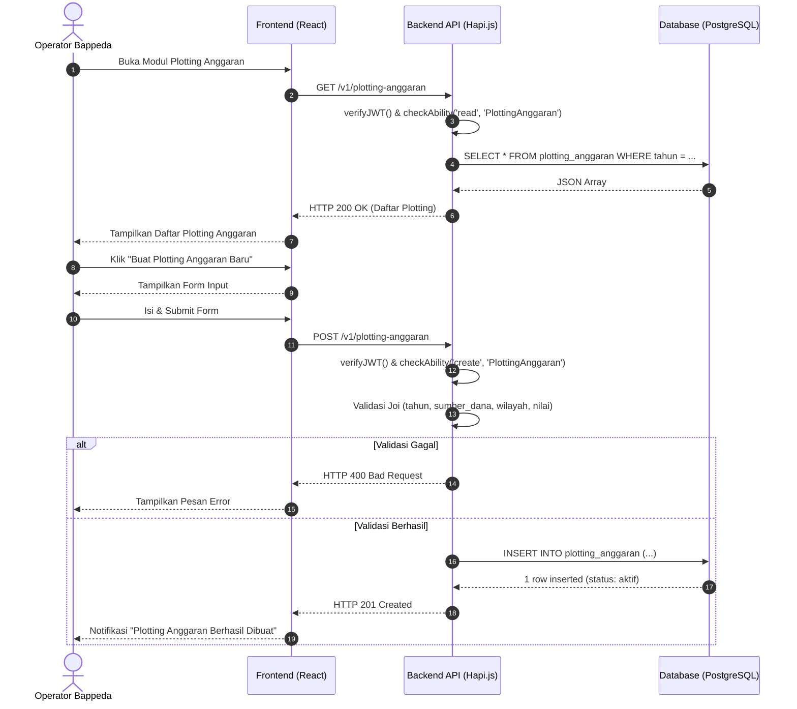

# Sequence Diagram: Pembuatan Plotting Anggaran

Diagram urutan ini menggambarkan interaksi teknis saat Operator Bappeda membuat Plotting Anggaran baru.

**Terkait**: [UC-1](../03-use-cases/UC-1-pembuatan-plotting-anggaran.md) | [AD-1](../04-activities/AD-1-plotting-anggaran.md)

## Penjelasan Teknis

1. **Authorization**: Hanya role `operator_bappeda` yang memiliki ability `create` pada subject `PlottingAnggaran`.
2. **Validasi**: Skema Joi memvalidasi field wajib (tahun anggaran, sumber dana, wilayah cakupan, nilai).
3. **Status**: Plotting Anggaran tersimpan dengan status `aktif`, yang kemudian menjadi prasyarat geotagging Desa dan draft monitoring.
