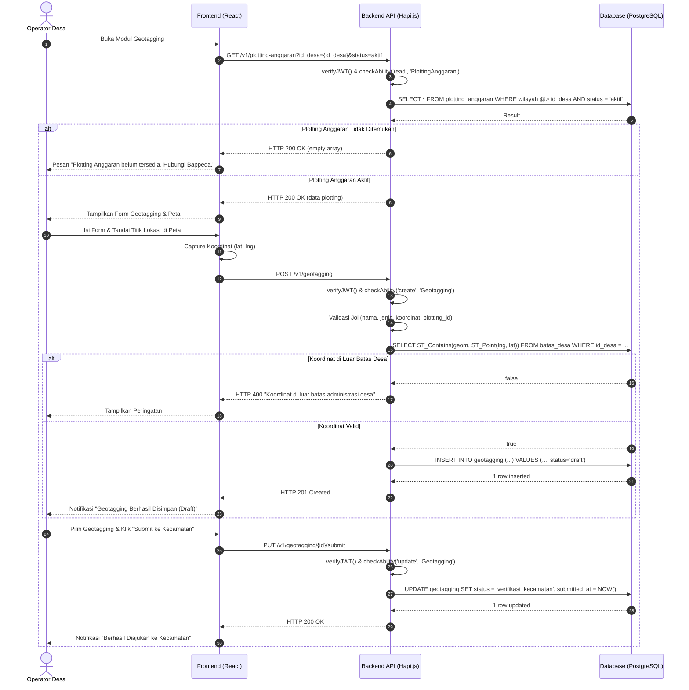

# Sequence Diagram: Geotagging & Submit oleh Desa

Diagram urutan ini menggambarkan interaksi teknis saat Operator Desa melakukan geotagging infrastruktur dan mengajukan form ke Kecamatan. Termasuk validasi prasyarat Plotting Anggaran.

**Terkait**: [UC-2](../03-use-cases/UC-2-geotagging-infrastruktur.md), [UC-3](../03-use-cases/UC-3-submit-geotagging-ke-kecamatan.md) | [AD-2](../04-activities/AD-2-geotagging-dan-submit.md)

## Penjelasan Teknis

1. **Validasi Plotting Anggaran**: Sebelum form geotagging ditampilkan, sistem memeriksa keberadaan Plotting Anggaran aktif untuk desa terkait (FR-GT-00, BR-PL-03).
2. **Validasi Spasial**: API menggunakan fungsi PostGIS `ST_Contains` untuk memastikan titik geotagging berada di dalam poligon batas desa (BR-WL-01).
3. **State Transition**: `draft` → `verifikasi_kecamatan`. Setelah submit, data terkunci dari edit oleh Desa (BR-VR-02).
4. **Ownership**: Data secara otomatis dikaitkan ke `id_desa` dari JWT payload pengguna.
