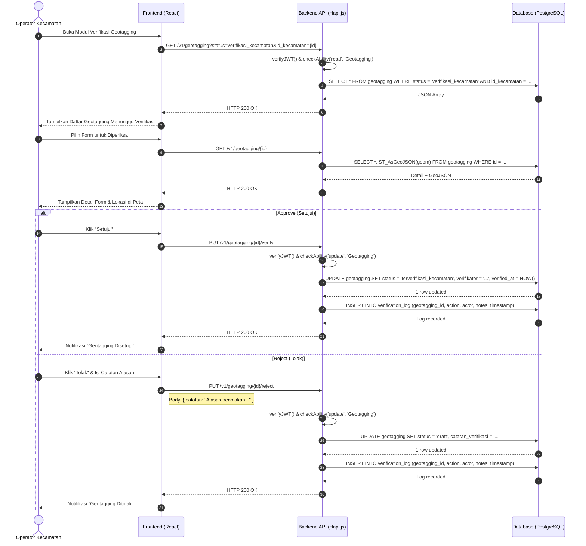

# Sequence Diagram: Verifikasi Geotagging oleh Kecamatan

Diagram urutan ini menggambarkan interaksi teknis saat Operator Kecamatan memverifikasi (approve/reject) form geotagging yang diajukan oleh Operator Desa.

**Terkait**: [UC-4](../03-use-cases/UC-4-verifikasi-geotagging.md) | [AD-3](../04-activities/AD-3-verifikasi-geotagging.md)

## Penjelasan Teknis

1. **Scope Filtering**: Query difilter berdasarkan `id_kecamatan` dari JWT payload, memastikan Kecamatan hanya melihat data di wilayahnya (BR-WL-02).
2. **Approve**: Status berubah `verifikasi_kecamatan` → `terverifikasi_kecamatan`. Data tetap terkunci dari Desa.
3. **Reject**: Status kembali ke `draft`. Data dibuka kunci agar Desa dapat memperbaiki. Catatan penolakan wajib diisi (BR-VR-03).
4. **Audit Trail**: Setiap keputusan dicatat di `verification_log` (FR-WF-04).
