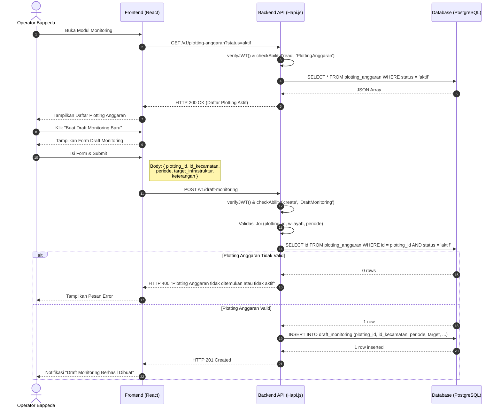

# Sequence Diagram: Pembuatan Draft Monitoring

Diagram urutan ini menggambarkan interaksi teknis saat Operator Bappeda membuat Draft Monitoring berdasarkan Plotting Anggaran. Draft ini menjadi acuan digitasi bagi Operator Kecamatan.

**Terkait**: [UC-5](../03-use-cases/UC-5-pembuatan-draft-monitoring.md) | [AD-4](../04-activities/AD-4-draft-monitoring.md)

## Penjelasan Teknis

1. **Validasi Relasi**: API memvalidasi bahwa `plotting_id` yang dirujuk benar-benar ada dan berstatus aktif sebelum menyimpan draft (BR-MN-01).
2. **Authorization**: Hanya role `operator_bappeda` yang memiliki ability `create` pada subject `DraftMonitoring`.
3. **Scope**: Draft monitoring dikaitkan ke `id_kecamatan` target, sehingga hanya Operator Kecamatan di wilayah tersebut yang dapat melihatnya.
