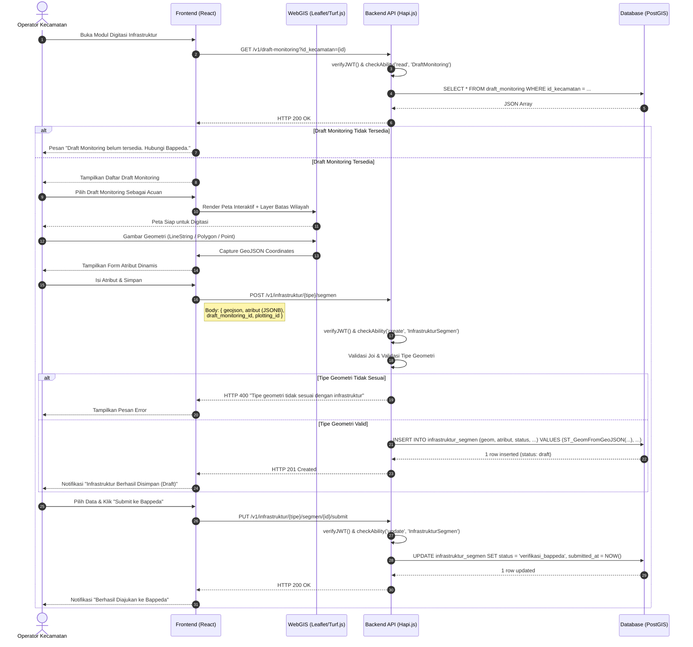

# Sequence Diagram: Digitasi Infrastruktur & Submit ke Bappeda

Diagram urutan ini menggambarkan interaksi teknis saat Operator Kecamatan melakukan digitasi infrastruktur spasial berdasarkan Draft Monitoring dan mengajukannya ke Bappeda.

**Terkait**: [UC-6](../03-use-cases/UC-6-digitasi-infrastruktur-spasial.md), [UC-7](../03-use-cases/UC-7-submit-infrastruktur-ke-bappeda.md) | [AD-5](../04-activities/AD-5-digitasi-dan-submit.md)

## Penjelasan Teknis

1. **Validasi Draft Monitoring**: Digitasi hanya bisa dilakukan jika Draft Monitoring tersedia untuk kecamatan terkait (BR-MN-02).
2. **GeoJSON → WKB**: Frontend mengirim geometri dalam format GeoJSON. Backend mengkonversinya ke format PostGIS menggunakan `ST_GeomFromGeoJSON` (TR-SP-03).
3. **Validasi Geometri**: API memastikan tipe geometri (LineString/Polygon/Point) sesuai dengan definisi tipe infrastruktur (TR-SP-01).
4. **Atribut Dinamis**: Atribut spesifik per tipe infrastruktur disimpan sebagai JSONB (FR-SP-03).
5. **State Transition**: `draft` → `verifikasi_bappeda`. Data terkunci dari edit oleh Kecamatan setelah submit (BR-VR-02).
