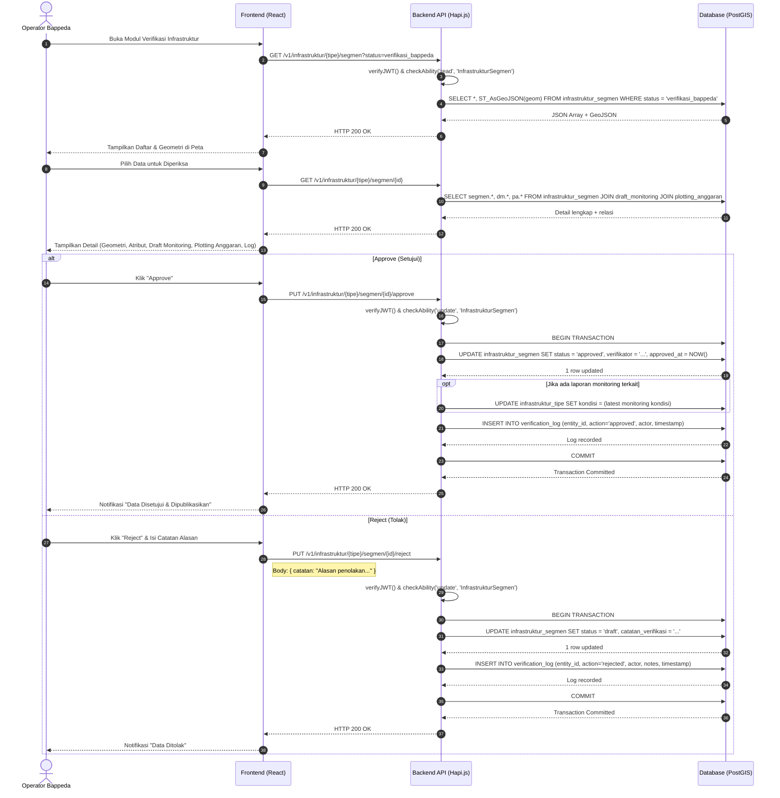

# Sequence Diagram: Approve/Reject Infrastruktur oleh Bappeda

Diagram urutan ini menggambarkan interaksi teknis saat Operator Bappeda melakukan persetujuan atau penolakan data infrastruktur spasial yang diajukan oleh Operator Kecamatan.

**Terkait**: [UC-8](../03-use-cases/UC-8-approve-reject-infrastruktur.md) | [AD-6](../04-activities/AD-6-approve-reject-infrastruktur.md)

## Penjelasan Teknis

1. **Database Transaction**: Operasi approve/reject menggunakan transaksi database untuk memastikan konsistensi antara update status dan pencatatan log (atomicity).
2. **Approve**: Status berubah `verifikasi_bappeda` → `approved`. Data dipublikasikan dan terkunci secara permanen. Data dapat dilihat oleh Publik.
3. **Reject**: Status kembali ke `draft`. Data dibuka kunci agar Kecamatan dapat memperbaiki. Catatan penolakan wajib diisi (BR-VR-03).
4. **Trigger Update Master**: Saat approve, jika ada laporan monitoring terkait, sistem dapat memperbarui atribut kondisi pada master infrastruktur (BR-MN-04).
5. **Audit Trail**: Setiap keputusan dicatat di `verification_log` yang bersifat immutable (BR-MN-03, FR-WF-04).
