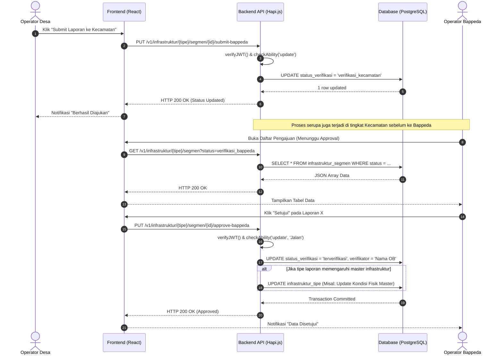

# Sequence Diagram: Verifikasi Laporan Monitoring

Diagram urutan (Sequence Diagram) di bawah menggambarkan interaksi teknis antar komponen ketika laporan monitoring diajukan oleh tingkat Desa dan diverifikasi hingga tingkat Bappeda.

## Penjelasan Teknis

1. **Authorization Middleware**: Sebelum _controller logic_ dieksekusi, API secara ketat memeriksa apakah token JWT valid (`verifyJWT`) dan apakah aktor yang melakukan _request_ memiliki hak akses (ability) yang cukup dengan mengevaluasi aturan CASL.
2. **State Transition**: Perpindahan _state_ (dari `draft` -> `verifikasi_kecamatan` -> `verifikasi_bappeda` -> `terverifikasi`) dijamin konsistensinya melalui _database transaction_.
3. **Trigger Update Master**: Saat status laporan diubah menjadi disetujui (terverifikasi), backend mungkin secara asinkron atau dalam satu transaksi akan menyinkronkan data atribut kondisi terbaru pada tabel master agar mencerminkan kondisi lapangan yang paling mutakhir.
