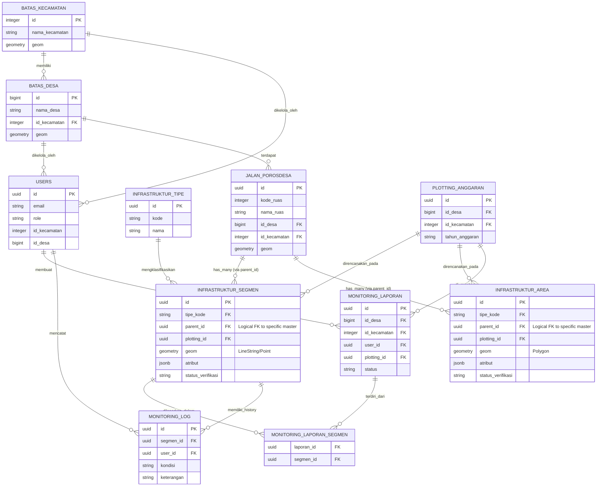

# Entity Relationship Diagram (ERD)

Berikut adalah diagram relasi entitas inti dari sistem GIGIS / MELAROSA, khususnya yang berpusat pada manajemen infrastruktur spasial dan proses monitoring.

> [!NOTE]
> ERD di atas menampilkan relasi konseptual utama. Tabel referensi lain seperti `jembatan_porosdesa`, `jalan_lingkungan` memiliki relasi yang serupa dengan `jalan_porosdesa` terhadap tabel `infrastruktur_segmen` / `infrastruktur_area`.
