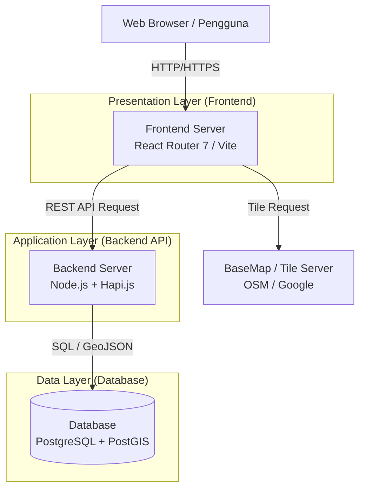

# System Architecture

GIGIS / MELAROSA menggunakan arsitektur _Client-Server_ modern berbasis Web dengan pemisahan _concern_ yang tegas antara _Frontend_ (Presentasi & Peta), _Backend_ (Logika Bisnis & API), dan _Database_ (Penyimpanan Data Spasial).

## High-Level Architecture Diagram

## Komponen Arsitektur Utama

1. **Frontend (Presentation Layer)**
    *   Aplikasi _Single Page Application_ (SPA) dan _Server Side Rendering_ (SSR) yang dibangun dengan **React Router 7** (sebelumnya Remix) dan **Vite**.
    *   Berperan merender antarmuka pengguna, menangani _state_ klien, otentikasi UI, dan merender peta dinamis menggunakan **React Leaflet** (dan/atau OpenLayers).

2. **Backend API (Application Layer)**
    *   Aplikasi _RESTful API_ yang dibangun dengan ekosistem **Node.js** dan framework **Hapi.js**.
    *   Berfungsi memvalidasi _request_, menegakkan otorisasi (RBAC/ABAC menggunakan `@casl/ability`), memproses logika bisnis spasial, dan berkomunikasi dengan database.

3. **Database (Data Layer)**
    *   Penyimpanan menggunakan **PostgreSQL**.
    *   Untuk kemampuan kalkulasi, penyimpanan, dan kueri data geospasial, database ini wajib dilengkapi dengan ekstensi **PostGIS**.
    *   Backend mengakses database menggunakan ORM **Sequelize**.

## Alur Data Secara Umum

1. Klien (Browser) merender Peta dan UI. Klien meminta data infrastruktur (dalam format GeoJSON) ke endpoint API (contoh: `/v1/infrastruktur/jalan/segmen`).
2. Backend Hapi.js menerima permintaan, memverifikasi _token_ JWT, dan mengecek otoritas pengguna (apakah ia berhak membaca data jalan di kecamatan tertentu).
3. Backend menggunakan Sequelize untuk menjalankan *query* ke PostgreSQL. PostGIS menerjemahkan data biner geometri (WKB) menjadi format GeoJSON sebelum dikembalikan ke backend.
4. Backend mengembalikan JSON *response* ke Frontend.
5. Frontend memetakan koordinat GeoJSON ke dalam poligon/garis di atas *Canvas* peta (menggunakan Leaflet).
